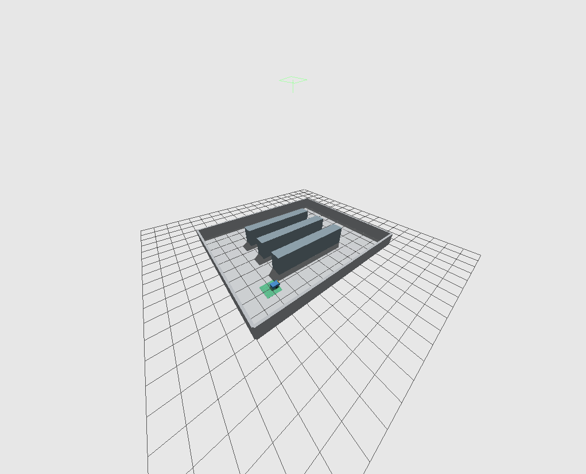

# Warehouse robot route optimization with ROS 2

Order-picking route optimization and replanning for a simulated warehouse mobile robot.

## Goal

The robot completes pickup jobs on a known aisle network and returns to the depot. The project examines route length and replanning after an aisle closure. Route length and robot execution time are evaluated separately.

## Planned features

- Warehouse layout, depot, and pickup jobs with unique identifiers.
- Comparison of FIFO, nearest-neighbor, and 2-opt pickup sequences.
- Robot motion and job execution with ROS 2 state feedback.
- Replanning from the current robot position after an aisle closure.
- Warehouse visualization, routes, job states, and measurement logs.
- Exact reference solutions for small cases and comparative evaluation for larger cases.

## Status

The warehouse world and differential-drive robot run in headless and graphical Gazebo modes. An odometry-based controller autonomously tracks a single goal and stops on arrival or feedback faults. Pickup sequencing, route planning, replanning, and comparative experiments remain under development.

## Development environment

The environment uses ROS 2 Humble and Gazebo Fortress on Ubuntu 22.04.
The container workflow below is tested with rootless Podman on Linux/amd64.

### Build the image

Run from the repository root:

```bash
podman build -f Containerfile -t localhost/var-e9t-warehouse:humble .
```

### Open the workspace

```bash
podman run --rm -it \
  --name var-e9t-warehouse-ros \
  --volume "$PWD:/workspace:Z" \
  localhost/var-e9t-warehouse:humble
```

The repository is mounted at `/workspace`. On SELinux hosts, `:Z` gives
this dedicated container access to the mounted directory. Exit the shell
to remove the container; source files remain on the host.

The image entrypoint loads ROS 2. Check the available tools inside the container:

```bash
printenv ROS_DISTRO
colcon --help
ign gazebo --versions
ros2 pkg prefix ros_gz_bridge
ros2 pkg prefix ros_gz_sim
```

### Open another terminal

While the workspace container is running:

```bash
podman exec -it var-e9t-warehouse-ros bash
```

Load ROS 2 in that new shell:

```bash
source /opt/ros/humble/setup.bash
```

References: [ROS/Gazebo installation](https://gazebosim.org/docs/jetty/ros_installation/)
and [Podman run](https://docs.podman.io/en/latest/markdown/podman-run.1.html).

Tested versions: ROS 2 Humble, Ubuntu 22.04, Gazebo Fortress 6.18.0,
ROS/Gazebo bridge and simulator packages 0.244.26, and Podman 5.8.4.

Validation covered a headless Gazebo server with an advancing ROS `/clock`,
cross-process ROS 2 message transfer, workspace writes, a second shell,
and a fresh container restart. Robot and GUI checks are described below.

## Robot simulation

Inside the workspace container, build and source the installed package:

```bash
colcon build --packages-select warehouse_sim
source install/setup.bash
ros2 launch warehouse_sim simulation.launch.py headless:=true
```

The launch loads local models from the installed package and starts Gazebo
with three directional ROS bridges. It also works outside the repository
directory after sourcing the workspace. Ctrl+C stops the launched simulation
and bridge. A fresh launch restores the initial robot pose.

### Graphical mode on Fedora KDE

This Xwayland workflow was tested with software rendering. Exit the headless
workspace container first. From a desktop terminal in the repository root,
with `DISPLAY` and `XAUTHORITY` set, open a GUI-enabled container:

```bash
podman run --rm -it \
  --name var-e9t-warehouse-ros \
  --memory 1536m --cpus 2 \
  --security-opt label=disable \
  --volume "$PWD:/workspace" \
  --volume /tmp/.X11-unix:/tmp/.X11-unix:ro \
  --volume "${XAUTHORITY:?Set XAUTHORITY in your desktop terminal}:/tmp/warehouse.xauth:ro" \
  --env DISPLAY \
  --env XAUTHORITY=/tmp/warehouse.xauth \
  --env QT_QPA_PLATFORM=xcb \
  --env QT_X11_NO_MITSHM=1 \
  --env LIBGL_ALWAYS_SOFTWARE=1 \
  localhost/var-e9t-warehouse:humble
```

SELinux label isolation is disabled for this GUI container to allow access
to the existing X11 socket and read-only authority file. X11 authentication
remains enabled. This configuration does not require GPU device access.

Inside the container, build if needed, source the workspace, and launch:

```bash
colcon build --packages-select warehouse_sim
source install/setup.bash
ros2 launch warehouse_sim simulation.launch.py
```



The image is captured from the running Gazebo scene. The blue body and yellow
front marker identify the robot; shelves and perimeter walls have collisions.

### ROS interfaces and motion

In a second container shell, load both ROS and the workspace:

```bash
source /opt/ros/humble/setup.bash
source /workspace/install/setup.bash
```

| Topic | ROS message | Direction | Units / meaning |
|---|---|---|---|
| `/warehouse/cmd_vel` | `geometry_msgs/msg/Twist` | ROS → Gazebo | linear.x in m/s; angular.z in rad/s |
| `/warehouse/odom` | `nav_msgs/msg/Odometry` | Gazebo → ROS | Position in m, quaternion orientation, velocity in m/s and rad/s |
| `/clock` | `rosgraph_msgs/msg/Clock` | Gazebo → ROS | Simulation time from `/world/warehouse/clock` |

Odometry is published at 20 Hz in simulation time, with parent frame `odom`
and child frame `warehouse_robot/base_link`. The robot starts at world
(-4, -3) m, facing +x. Odometry starts near (0, 0); its origin is separate
from the world origin. No ROS TF tree is provided yet.

Publish a forward command continuously, then interrupt the publisher:

```bash
ros2 topic pub --rate 20 /warehouse/cmd_vel geometry_msgs/msg/Twist \
  "{linear: {x: 0.2}, angular: {z: 0.0}}"
```

**Interrupting the publisher does not stop the robot.** The DiffDrive plugin
holds the last command. Send an explicit zero command after every motion:

```bash
ros2 topic pub --once /warehouse/cmd_vel geometry_msgs/msg/Twist "{}"
```

For an in-place turn, use the same procedure and explicit stop:

```bash
ros2 topic pub --rate 20 /warehouse/cmd_vel geometry_msgs/msg/Twist \
  "{linear: {x: 0.0}, angular: {z: 0.4}}"
```

Inspect feedback with `ros2 topic echo /warehouse/odom`. Motion is acceleration
limited; a zero command produces a short braking interval. The simulation
supports manual commands and the single-goal controller below. Obstacle
avoidance and an independent drive-side command watchdog are not implemented.

### Model assumptions and checks

The 4 kg body measures 0.50 × 0.32 × 0.16 m. Two 0.20 kg cylindrical wheels
have radius 0.08 m, width 0.02 m, and center separation 0.38 m. Box and cylinder
inertias are calculated from those dimensions. Two frictionless spherical
supports approximate caster contacts. The warehouse uses three 6 × 0.8 m
shelf rows with 1.2 m gaps, inside a 12 × 10 m floor.

The built-in Gazebo DiffDrive plugin provides wheel control and wheel-based
odometry. These are simulation components, separate from the planned route
optimizer. Contact effects can cause wheel odometry to differ from actual
model motion; odometry covariance is not a measured uncertainty estimate.

Checks on the installed package covered stationary stability, motion,
explicit stopping, command loss, shutdown, and restart. Physical model poses
were sampled independently from Gazebo and compared with odometry at matching
simulation timestamps. Representative headless measurements were:

| Check | Odometry | Gazebo model pose |
|---|---|---|
| Forward, 0.20 m/s for 5 simulated seconds | 0.986 m | 0.985 m |
| Turn, 0.40 rad/s for 4 simulated seconds | 1.546 rad | 1.620 rad |
| Braking after the forward command | 0.0138 m | 0.0142 m |

The robot remained stationary during a 10-second rest check. Odometry averaged
20 Hz in simulation time. GUI mode also passed forward-motion and stop checks.
These are integration checks, not route-planning results or real-time guarantees.

Technical references: [SDF robot construction](https://gazebosim.org/docs/fortress/building_robot/),
[Gazebo DiffDrive](https://gazebosim.org/docs/fortress/moving_robot/), and
[ROS/Gazebo bridge](https://gazebosim.org/docs/fortress/ros2_integration/).
The project model and layout use primitive geometry; no tutorial robot or
external mesh is bundled. Project files are licensed under BSD-3-Clause;
installed third-party components retain their own licenses.

## Single-goal control

The `warehouse_control` package tracks one fixed goal in the `odom` frame.
The tracking calculation is implemented in `control.py`, independently of
ROS transport: rotate in place for large heading errors, then advance with
bounded proportional steering and slow down near the goal. It does not plan
a collision-free route; use goals in known free space.

In the workspace container, build both packages and start a fresh simulation:

```bash
colcon build --packages-select warehouse_sim warehouse_control
source install/setup.bash
ros2 launch warehouse_sim simulation.launch.py headless:=true
```

In another container shell, run the controller:

```bash
source /opt/ros/humble/setup.bash
source /workspace/install/setup.bash
ros2 run warehouse_control goal_controller --ros-args \
  -p use_sim_time:=true -p target_x:=1.0 -p target_y:=0.0
```

Only one velocity-command publisher should run at a time. Stop any manual
publisher before starting the controller. With the initial robot pose, the
example goal corresponds to world (-3, -3) m. These are absolute odometry
coordinates, not a relative displacement from wherever the robot currently
stands. Start a fresh simulation for repeatable tests.

| Startup parameter | Default | Meaning |
|---|---|---|
| `target_x`, `target_y` | 1.0, 0.0 m | Goal in `odom` |
| `goal_tolerance` | 0.05 m | Wheel-odometry arrival tolerance |
| `max_linear_speed` | 0.15 m/s | Forward speed limit |
| `max_angular_speed` | 0.60 rad/s | Yaw-rate limit |
| `linear_gain`, `angular_gain` | 0.5, 1.5 1/s | Proportional gains |
| `turn_threshold` | 0.35 rad | Above this error, rotate without advancing |
| `odom_timeout` | 1.0 s | Wall-time feedback timeout and maximum ROS-time stamp offset |

These control parameters are read-only after startup. Commands use a 20 Hz
steady-clock timer; this is not a real-time guarantee. The odometry subscriber
uses best-effort, volatile, keep-last 1 QoS; commands are reliable, volatile,
keep-last 1. Simulation runs require `use_sim_time:=true`.

The node initially publishes zero while waiting for valid feedback.
`TRACKING` requires finite planar pose values, valid orientation, the expected
frames, and advancing timestamps near ROS time. Invalid feedback, stale or
persistently repeated timestamps, or a backwards clock jump lead to a latched `FAULT` and zero
commands. The wall-time timeout continues even when simulation time stops.
Arrival latches `REACHED`; the node stays alive publishing zero. Restart the
controller to clear either terminal state or select another goal.

Ctrl+C and SIGTERM request zero before closing the ROS context. This is
not an independent drive-side command watchdog: a crash, SIGKILL, or loss
of the command bridge can prevent stopping, and DiffDrive can retain the
last command. Wheel odometry can differ from the physical model pose.

### Controller checks

Run the deterministic calculation tests:

```bash
colcon test --packages-select warehouse_control --event-handlers console_direct+
colcon test-result --verbose
```

All 50 tests passed. Installed-package checks also ran from `/tmp`.
Representative headless runs independently sampled Gazebo model poses,
with the goal converted into world coordinates:

| Goal in odom (m) | Settled odometry error | Settled physical error |
|---|---|---|
| (1.0, 0.0) | 0.049 m | 0.049 m |
| (0.0, -0.75) | 0.049 m | 0.069 m |

Both goals reached the 0.05 m odometry tolerance within 60 simulated seconds.
After braking, no further physical displacement was observed over two
simulated seconds. A controlled feedback interruption, with the command
bridge still running, produced a stop request after 1.04 wall seconds and
remained stopped when feedback returned. Isolated ROS checks covered absent
feedback, repeated timestamps, invalid frames/orientation/non-finite position,
stale timestamps, and paused/backwards clocks. Ctrl+C and SIGTERM stop checks
passed with the physical model remaining stationary after braking.
These are initial integration checks, not statistical route-planning results.

ROS infrastructure references: [Python publisher/subscriber](https://docs.ros.org/en/humble/Tutorials/Beginner-Client-Libraries/Writing-A-Simple-Py-Publisher-And-Subscriber.html),
[QoS compatibility](https://docs.ros.org/en/humble/Concepts/Intermediate/About-Quality-of-Service-Settings.html),
and [rclpy node API](https://docs.ros.org/en/humble/p/rclpy/api/node.html).
