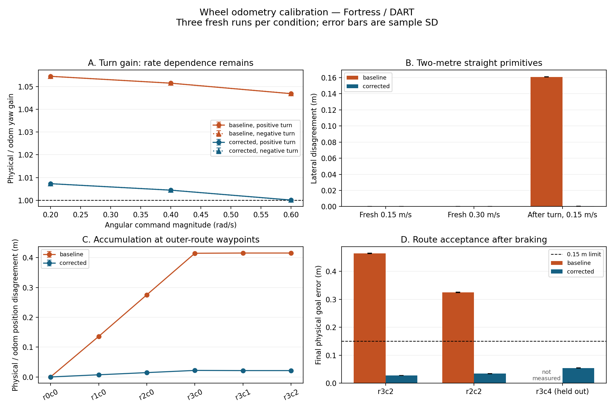

# Wheel odometry diagnosis and calibration — 2026-10-10

The original physical goal-error failure is resolved for the tested simulation
configuration. Both original routes and the reserved `r3c4` route passed all
physical gates in three fresh runs each. The acceptance limit remains **0.15 m**.
Gazebo world pose remained an independent verification stream throughout.

## Measurement design

Every trial starts a fresh installed world in an owned rootless Humble
container. Concurrent batches use separate ROS domains (80–88) and Ignition
partitions; each world has one command publisher at most. The fault batch uses
domain 89. The container image is `localhost/var-e9t-warehouse:humble`.
Versions: Ubuntu 22.04, ROS 2 Humble, Gazebo Fortress 6.18.0, loaded DART physics
plugin 5.4.0 and Python 3.10.12.

The baseline includes 27 primitive trials and six full routes. The primitive
matrix has three repeats of each +/-0.2, +/-0.4 and +/-0.6 rad/s turn, each
0.15 and 0.30 m/s two-metre straight, and a +0.6 turn followed by a 0.15 m/s
straight. Wheel odometry decides when to send zero; physical pose does not
control motion. A turn stops commanding at pi/2 odom yaw change, then brakes,
so the measured final angle includes braking and need not equal pi/2.

Physical poses come directly from Gazebo transport with source simulation
timestamps. Endpoint and waypoint analysis brackets and interpolates both
streams at common timestamps, with yaw interpolation along the short arc.
Unbracketed data, non-increasing timestamps or gaps above 0.1 s are rejected.
Waypoint logs now expose the odometry timestamp used at each arrival. Endpoint
distance is the displacement norm; direction error is the difference between
physical and odom displacement bearings; lateral error projects the physical
straight displacement normal to its initial odom heading. World frame origin
and yaw are taken from the installed SDF spawn.

All reported means, ranges and sample SDs describe three fresh deterministic
simulation runs. They are not hardware accuracy or localization uncertainty.

## Geometry audit and contact sensitivity

The original model was geometrically consistent: wheel centers `(0,+/-0.19,
0.08)` m, separation 0.38 m, collision radius 0.08 m, tread width 0.02 m, joint
axes along y and cylinder axes parallel to the joints after the collision pose
rotation. Both wheel centers are at radius height. Cylinder inertias match
0.20 kg, 0.08 m radius and 0.02 m width. Joint names also match DiffDrive.

Straight-only distance and heading data do not support a radius correction.
The turn data identify a systematic, nearly direction-symmetric yaw gain with
rate dependence. A separate six-run experiment changed only the *temporary*
wheel collision width from 0.02 to 0.002 m, retaining nominal centers, radius,
visuals, mass and inertia. The physical/odom yaw gain at +/-0.6 fell from about
1.0469 to 1.0044. This demonstrates contact-width sensitivity; it does not
identify individual contact forces or prove a physics-engine defect. The narrow
contact proxy was not deployed and did not participate in the calibration fit.

## Offline calibration

Only the six standalone +/-0.6 rad/s baseline turns (three per direction) were
used. All route results, other rates, turn-then-straight results and narrowed
contact data were excluded. The zero-intercept least-squares relation is
`physical_delta_yaw = k * odom_delta_yaw`.

Measured `k = 1.046869919`. The implied effective track is `0.38 / k = 0.362986836` m. The predefined millimetre rounding gives **0.363 m**. Fit residual sample SD was 8.23e-05 rad.

Before editing the production model, six independent temporary-candidate
turns verified the value. The largest absolute yaw mismatch was below 0.000231
rad. The production change is only DiffDrive's effective `wheel_separation`:
**0.38 → 0.363 m**. Physical center separation remains 0.38 m; radius, tread,
collision geometry, mass, inertia, world, graph and controller gains remain
unchanged. This is an empirical effective rolling track for these dynamics,
not a claim that the mechanical center distance changed.

The [Fortress DiffDrive source](https://github.com/gazebosim/gz-sim/blob/ign-gazebo6/src/systems/diff_drive/DiffDrive.cc)
uses the configured separation for both wheel-command conversion and encoder
odometry. Calibration therefore corrects the simulated kinematic mapping;
it introduces no runtime world-pose input, goal-specific offset or localization.
The installed model SHA-256 was checked against the source and matched.

## Repeated primitive results

Gain below is physical yaw change divided by odom yaw change. Every row has
three fresh runs; SD is sample SD. Angles include braking.

| Angular command | Before gain, mean ± SD | After gain, mean ± SD | Before / after absolute yaw error, mean (rad) |
|---|---:|---:|---:|
| +0.2 rad/s | 1.054485 ± 1.3e-06 | 1.007313 ± 7.3e-08 | 0.086734 / 0.011592 |
| +0.4 rad/s | 1.051470 ± 1.1e-05 | 1.004462 ± 1.5e-05 | 0.083959 / 0.007291 |
| +0.6 rad/s | 1.046860 ± 4.6e-05 | 1.000126 ± 3.5e-05 | 0.079831 / 0.000215 |
| -0.2 rad/s | 1.054484 ± 3.2e-06 | 1.007315 ± 1e-06 | 0.086656 / 0.011612 |
| -0.4 rad/s | 1.051483 ± 7.8e-06 | 1.004484 ± 2.4e-06 | 0.084247 / 0.007370 |
| -0.6 rad/s | 1.046879 ± 6e-05 | 1.000066 ± 6.7e-05 | 0.080042 / 0.000112 |

| Straight condition | Before / after maximum distance mismatch (mm) | Before / after direction error, mean (rad) | Before / after lateral error, mean (m) |
|---|---:|---:|---:|
| Fresh, 0.15 m/s | <0.001 / <0.001 | 0.000000 / 0.000000 | -0.000000 / -0.000000 |
| Fresh, 0.30 m/s | <0.001 / <0.001 | 0.000000 / 0.000000 | -0.000000 / -0.000000 |
| After +0.6 turn, 0.15 m/s | 0.008 / <0.001 | 0.080188 / 0.000175 | 0.160993 / 0.000352 |

Fresh straight runs have negligible additional heading drift. The baseline
turn-then-straight direction error is inherited from the turn, rather than
created by straight distance scaling. Raw values below the displayed distance
precision are available in the JSON; they are solver measurements, not a
micrometre hardware accuracy claim. Lower-rate yaw bias remains after the
single effective-track correction, so it is not a universal calibration.

## Accumulation at waypoints

Position disagreement is the physical pose minus transformed odometry at the
same arrival timestamp. It is distinct from error relative to the graph goal.
Values are means of three runs. Per-run vectors, goal errors, yaw values and
statistics are preserved in the machine-readable report.

### `r3c2`

| Waypoint | Before / after position disagreement (m) | Before / after yaw disagreement (rad) |
|---|---:|---:|
| r0c0 | 0.000000 / 0.000000 | 0.000000 / 0.000000 |
| r1c0 | 0.135824 / 0.007249 | 0.070390 / -0.003656 |
| r2c0 | 0.275264 / 0.014551 | 0.069697 / -0.003659 |
| r3c0 | 0.414597 / 0.021879 | 0.069705 / -0.003666 |
| r3c1 | 0.415342 / 0.021351 | 0.000774 / 0.000168 |
| r3c2 | 0.415338 / 0.021341 | 0.000291 / 0.000173 |

### `r2c2`

| Waypoint | Before / after position disagreement (m) | Before / after yaw disagreement (rad) |
|---|---:|---:|
| r0c0 | 0.000000 / 0.000000 | 0.000000 / 0.000000 |
| r1c0 | 0.135675 / 0.007234 | 0.070302 / -0.003647 |
| r2c0 | 0.274972 / 0.014521 | 0.069626 / -0.003651 |
| r2c1 | 0.275730 / 0.014008 | 0.000667 / 0.000118 |
| r2c2 | 0.275730 / 0.013995 | 0.000223 / 0.000121 |

### `r3c4` — reserved route

| Waypoint | Before / after position disagreement (m) | Before / after yaw disagreement (rad) |
|---|---:|---:|
| r0c0 | not measured / 0.000000 | not measured / 0.000000 |
| r0c1 | not measured / 0.000000 | not measured / -0.000000 |
| r0c2 | not measured / 0.000001 | not measured / -0.000000 |
| r0c3 | not measured / 0.000000 | not measured / -0.000000 |
| r0c4 | not measured / 0.000004 | not measured / -0.000000 |
| r1c4 | not measured / 0.007633 | not measured / -0.003849 |
| r2c4 | not measured / 0.015327 | not measured / -0.003854 |
| r3c4 | not measured / 0.023018 | not measured / -0.003848 |

The second turn on the original routes largely cancels the accumulated yaw
bias but does not undo the position error acquired on earlier straight legs.
The correction greatly reduces that positional accumulation. Final graph-goal
error can be smaller than odom error when the residual vector and termination
offset oppose each other; waypoint disagreement and the reserved route are
therefore reported independently.

The corrected moving legs retain roughly -0.0037 to -0.0039 rad mean heading
disagreement. Standalone turn accuracy does not eliminate the residual from
combined turning and advancing; the tables quantify its remaining accumulation.

## Full route validation after calibration

The same gates remain: ordered waypoints, at most 180 simulation seconds,
0.05 m final odom error, **0.15 m physical error**, zero command, at least five
seconds of physical rest after braking, and conservative sampled segment checks
against seven shelf/wall obstacles expanded by a 0.3202 m robot radius.
Each trial also has a finite 240 s wall-time deadline. The installed controller
is launched through `ros2 run` from `/tmp` with `use_sim_time:=true`.

| Route | Length | Runs | Time range (s) | Odom error range (m) | Physical error range (m) | Result |
|---|---:|---:|---:|---:|---:|---|
| r3c2 | 10 m | 3 | 81.422–82.948 | 0.048742–0.049177 | 0.027156–0.027969 | all gates passed |
| r2c2 | 8 m | 3 | 66.211–66.400 | 0.047567–0.048855 | 0.033664–0.034772 | all gates passed |
| r3c4 (reserved) | 14 m | 3 | 109.692–109.864 | 0.047602–0.049158 | 0.053778–0.054997 | all gates passed |

All nine routes had zero sampled obstacle intersections and zero final commands. The largest physical sample gap was 0.019 s; minimum verified rest was 5.002 s. Maximum measured rest translation, sampled speed and yaw change were all zero.

`r3c4` was declared as the holdout before fitting and was first run only after
the parameter was frozen. Its 14 m route traverses the bottom aisle first,
then the right-hand vertical aisle, with one left turn; the original routes
start up the left aisle and then turn right. All eight held-out waypoints
arrived in order. No parameter was revised from route outcomes.

The calibrated model also passed the eight fault/regression cases: odom bridge
interruption while the command bridge remains active, feedback recovery without
rearming, actual terminal Ctrl+C, direct node SIGTERM, invalid goal, unreachable
graph overlay, synthetic invalid odom start, real moved start, and the existing
single-goal regression. The odom interruption/recovery is one case. Each
included independent physical rest checking. Final Humble package results:
**242 passed, 0 failures, 0 errors, 0 skipped**.



## Reproduction and artifacts

Build/source the installed workspace inside a dedicated isolated container.
Use fresh output paths; the harness refuses to overwrite existing measurements.

```bash
export ROS_DOMAIN_ID=80 IGN_PARTITION=warehouse-diagnostic-reproduction
source /opt/ros/humble/setup.bash
source /workspace/install/setup.bash
cd /tmp
python3 /workspace/scripts/diagnose_odometry.py \
  --repeat 3 --output /workspace/log/new-primitive-run
python3 /workspace/scripts/validate_route_following.py \
  --case r3c2 --case r2c2 --case r3c4 --repeat 3 \
  --output /workspace/log/new-route-run
```

[Machine-readable measurements](odometry-diagnostics-results.json) include
training inputs, per-run outcomes, waypoint vectors, summary statistics, model
audits and source hashes. The ignored `log/odometry-diagnostics/` directory holds
raw timestamped physical/odom/command streams, logs, fit parameters and temporary
models. The original local changes were snapshotted before this follow-up.
The [pre-calibration validation record](route-following-validation.md) remains
available as historical evidence. No commit or push was performed.

To reproduce the baseline without changing source, copy the model directory to
a fresh temporary `models/warehouse_robot` resource tree and set only its
DiffDrive `wheel_separation` back to `0.38`. Pass that tree with `--model-dir`
to the primitive and route harnesses. The fit tool
`scripts/fit_diffdrive_calibration.py` accepts the resulting primitive
`results.json` and writes a candidate into a new output directory; it never
edits the production model. Test the candidate before applying any source change.

## Limits

This is a calibrated simulation configuration, not online localization or a
hardware guarantee. The effective track differs from mechanical center spacing
and is specific to the observed Fortress/DART contact dynamics, friction,
tread, mass, motion rates and solver settings. The measured low-rate yaw bias
remains; changed dynamics need independent validation. Three repeats quantify
repeatability under these conditions, not a population reliability estimate.

Gazebo world pose was recorded during motion and analyzed offline; it never
selected a waypoint, steered a running controller or corrected its live pose. Route
odometry covariance still does not represent measured localization uncertainty.
Sampled geometry is not a continuous collision/contact guarantee. No independent
drive watchdog, dynamic obstacle handling or replanning was added; a crash,
SIGKILL or command-bridge failure can still leave DiffDrive holding a command.
